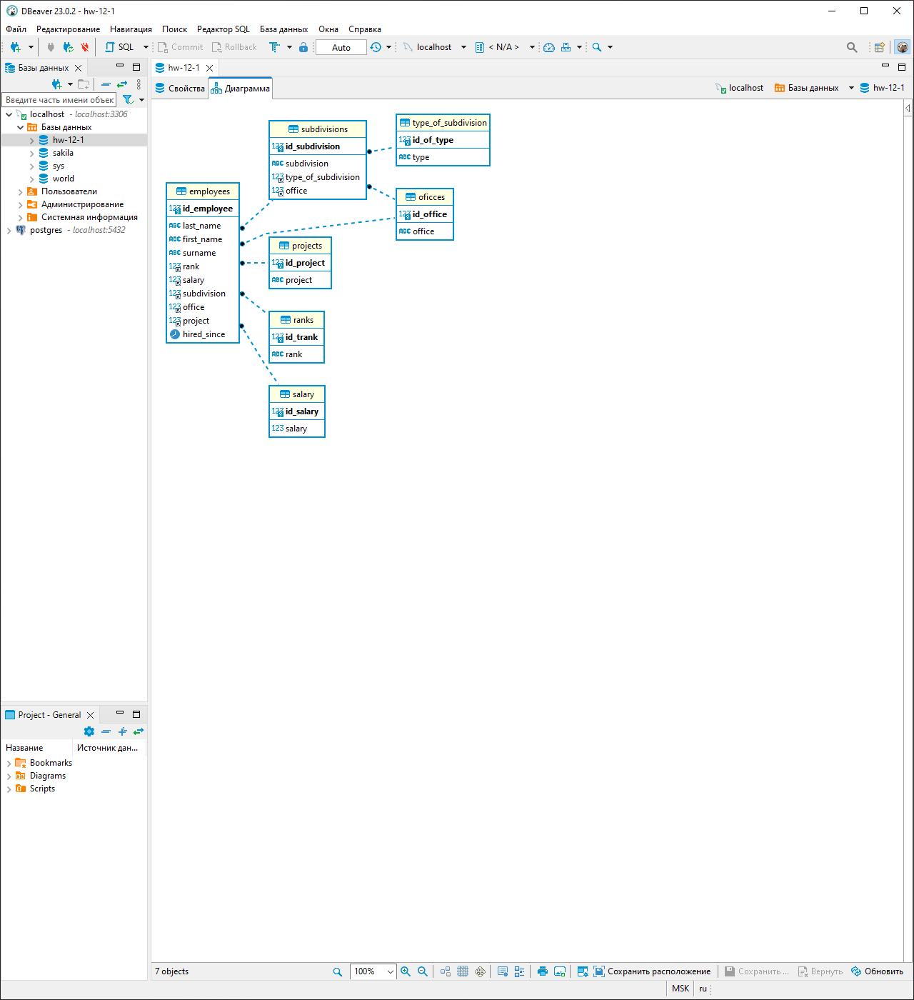

# Домашнее задание к занятию «Базы данных»
---
### Легенда

Заказчик передал вам [файл в формате Excel](https://github.com/netology-code/sdb-homeworks/blob/main/resources/hw-12-1.xlsx), в котором сформирован отчёт. 

На основе этого отчёта нужно выполнить следующие задания.

### Задание 1

Опишите не менее семи таблиц, из которых состоит база данных:

- какие данные хранятся в этих таблицах;
- какой тип данных у столбцов в этих таблицах, если данные хранятся в PostgreSQL.

Приведите решение к следующему виду:

Сотрудники (

- идентификатор, первичный ключ, serial,
- фамилия varchar(50),
- ...
- идентификатор структурного подразделения, внешний ключ, integer).

---

employees (
- id_employee, int, not null, primary_key
- last_name, varchar(50), not null
- first_name, varchar(50), not null
- surname, varchar(50)
- rank, foreign_key
- salary, foreign_key
- subdivision, foreign_key
- office, foreign_key
- project, foreign_key
- hired_since, date, not null
)
---

subdivisions (
- id_subdivision, int, not null, primary_key
- subdivision, varchar(100), not null
- type_of_subdivision, foreign_key
- office, foreign_key
)
---

type_of_subdivision (
- id_of_type, int, not null, primary_key
- type
)
---

offices (
- id_office, int, not null, primary_key
- office, varchar(200), not null
)
---

projects (
- id_project, int, not null, primary_key
- project, varchar(100), not null
)
---

ranks (
- id_rank, int, not null, primary_key
- rank, varchar(100), not null
)
---

salary (
- id_salary, int, not null, primary_key
- salary, real, not null
)
---

